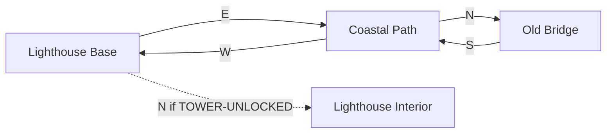
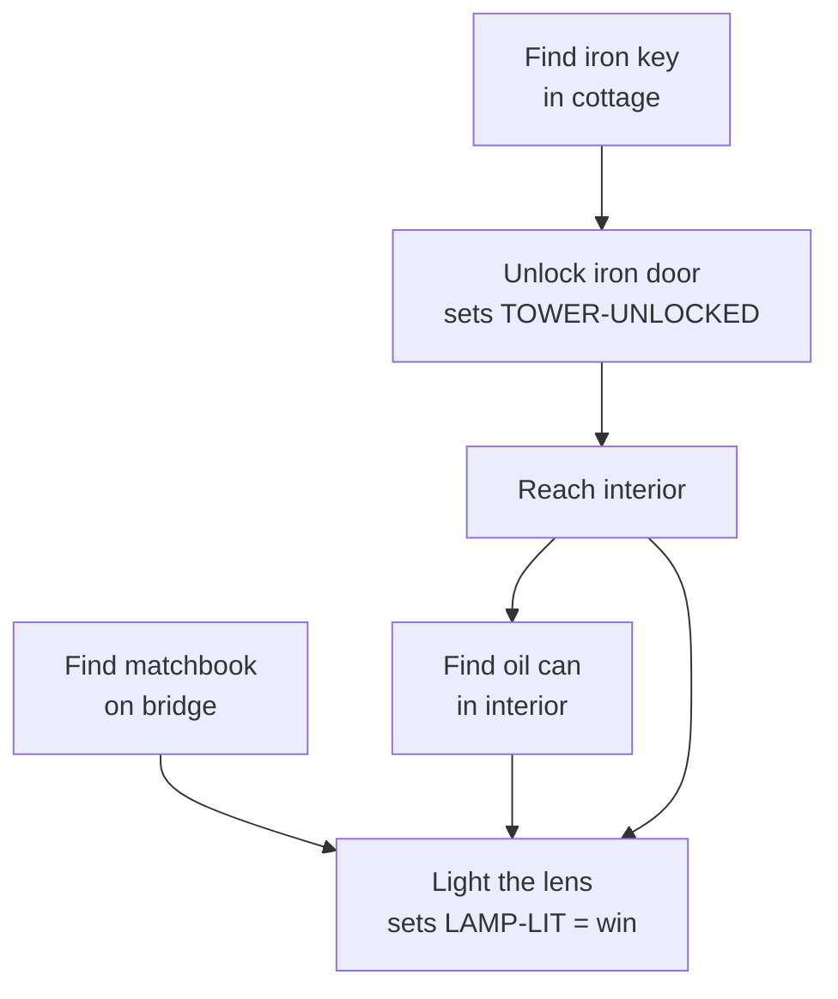

# Writing Adventures for AdventureArena

This guide covers everything needed to create a text adventure game in ZIL format for the AdventureArena engine. The runtime uses the zilscript Lua interpreter, which supports a subset of ZIL (Zork Implementation Language) — the same language used by Infocom to create Zork, Planetfall, Hitchhiker's Guide, and dozens of other classic interactive fiction titles.

It is a single manual in two halves. **Part I — The Craft** is the artistic side: how to design a game that is worth playing, distilled from how Infocom actually worked. **Part II — The Manual** is the technical side: the exact ZIL you write and the files you ship. Between them sits a section on **working materials** — the maps, ledgers, and charts you should keep beside the code, the same "sheets of paper" Infocom's writers covered their desks with, adapted so an LLM can navigate the ZIL it is writing.

Read Part I before you invent anything. Keep the working materials open while you code. Reach for Part II for syntax.

---

## Table of Contents

**Part I — The Craft (design before code)**

1. [Start With the Story, Not the Code](#1-start-with-the-story-not-the-code)
2. [Separate World, Prose, and Parser](#2-separate-the-world-model-from-the-prose-from-the-parser)
3. [Puzzle Design Is Adversarial and Collaborative](#3-puzzle-design-is-adversarial-and-collaborative)
4. [Distrust Your Own Systems](#4-distrust-your-own-systems-test-for-interaction-bugs)
5. [Text Is a Design Choice](#5-text-is-a-design-choice)
6. [Crafting Great Adventures (Infocom lessons)](#crafting-great-adventures)
7. [Suggested Build Order](#suggested-build-order)

**Working Materials — Navigating the ZIL You Write**

8. [Working Materials: The Sheets of Paper on Infocom's Desks](#working-materials-the-sheets-of-paper-on-infocoms-desks)

**Part II — The Manual (the ZIL you write)**

9. [Game Structure](#game-structure)
10. [ZIL Syntax Reference](#zil-syntax-reference)
11. [Advanced Techniques (from Zork I)](#advanced-techniques-from-zork-i)
12. [Complete Example](#complete-example)
13. [Testing Your Adventure](#testing-your-adventure)
14. [Adventure Folder Files](#adventure-folder-files)
15. [Checklist](#checklist)

---

# Part I — The Craft

> Source for much of this part: Dave Lebling (Infocom), interviewed on BBC's *Micro Live*, 1985, during development of *Spellbreaker*, together with the accounts of Infocom's own Implementors ("Imps") in *The New Zork Times* and the histories collected at the [Digital Antiquarian](https://www.filfre.net/) and the [IF Archive](https://www.ifarchive.org/indexes/if-archive/infocom/). Infocom's practices still hold up as the clearest known model for how to build a text adventure that is fair, coherent, and worth playing.

Before touching a parser, an object model, or a scripting language, design the game. Puzzles derived from code are arbitrary; puzzles derived from a world are fair. The sections below are written for an LLM (or a human) building a new game or engine.

## 1. Start with the story, not the code

> "It's almost like writing a book. You come up with a plot... and then you start thinking of logic puzzles and things which will advance the plot and at the same time provide intellectual stimulation for the people who are playing it." — Dave Lebling

- Write the premise as prose first. One paragraph is enough: what is the world, what changed, what does the player want.
- Derive puzzles *from* the plot's internal logic, not the other way around. A puzzle should feel like it was always true about this world, not bolted on to gate progress.
- Do not start with "what puzzles should I put in a dungeon." Start with "what is broken in this world, and what would someone who lived here actually need to do about it."

**For an LLM:** when asked to build a game, resist jumping straight to room lists and item tables. Produce a one-paragraph premise, then a short list of "things that are wrong in this world," and only then break those into concrete puzzles. Treat the premise as the spec the puzzles must serve.

## 2. Separate the world model from the prose from the parser

Infocom's language, ZIL, existed specifically so that writers didn't have to reimplement object/container/character logic every time:

> "The language itself knows a lot about interactive fiction... built into the language are a lot of tools for manipulating objects and characters, so each writer doesn't have to start from scratch... writers and programmers aren't necessarily the same sort of creatures, and you really want to give the writers the best tools you can." — Dave Lebling

Practical structure to reuse for any new game or engine:

- **World model layer**: objects, locations, containment, ownership, state flags. Generic verbs (take, open, put X in Y, examine) operate here and should work correctly for *any* object without per-object code, unless the object explicitly overrides behavior.
- **Content layer**: rooms, item descriptions, puzzle-specific logic. This is where the "writing" happens, and it should be as declarative as possible — describing what's true, not how the engine works.
- **Parser layer**: strictly separate from both. Its job is turning "put the cube in the bag" into a verb + object references the world model understands. It should never contain puzzle logic.

In AdventureArena this separation is already made for you: the engine (parser, verbs, syntax, clock, globals, main) lives in `infocom/zork1/`; your `dungeon.zil` is the declarative content layer; your `actions.zil` holds only the per-object overrides. Keep puzzle logic out of the engine files, and keep the generic model out of your game.

## 3. Puzzle design is adversarial and collaborative

The mouth-of-the-idol puzzle in the Lebling interview is the clearest example:

> "I invented the idol, I invented its mouth, so I thought about it for a while, I couldn't come up with an answer, so I talked to the other writers and got, as it turned out, some very good suggestions." — Dave Lebling

And the punchline: even the designer who invented the puzzle got the solution *wrong* when trying to solve his own game live on camera.

- **The person who designs a puzzle is not automatically the person who can validate it.** Designing a fair obstacle and solving it fresh are different skills. Get a second and third opinion on every puzzle before considering it finished.
- **A puzzle should have a solution that follows from stated facts, not from guessing the author's intent.** Lebling's idol puzzle worked because the solution ("animate the idol so it yawns") followed logically from established facts already in the world: there's an animation spell, mouths open when you yawn, stone can be animated. It wasn't arbitrary.
- **Expect and design for multiple attempted solutions.** In the transcript the player tries: take it, hit it with a knife, use a general "open" spell, check for a hinge. A well-built puzzle needs sensible, in-world rejection responses for the plausible wrong answers, not just silence or a generic failure message. Write the "reasonable failures" as carefully as the win condition.

**For an LLM:** when generating a puzzle, don't stop at the solution. Also generate the 3–5 most likely wrong attempts a reasonable player would try, and write a specific, in-character response for each. If you can't think of plausible wrong attempts, the puzzle is probably too obscure or too easy. Record these in the puzzle chart (see [Working Materials](#working-materials-the-sheets-of-paper-on-infocoms-desks)).

## 4. Distrust your own systems: test for interaction bugs

The Gurgoyle spell bug from the interview is the most technically instructive part:

> "It's called Gurgoyle, and what it does is stop time... the status line updates, everything still happens to you, because time is subjective in this game... the problem is the interrupt routines — things that run periodically, like a million tons of rock falling on your head — have to stop." — Dave Lebling

This is a *systems interaction* bug, not a content bug: a subjective clock and a scheduled/periodic event system were each individually correct but broke when combined. A second bug shows up on stream — a direction-listing routine that never terminates ("south south south... forever") — a plain infinite-loop regression from a rewrite.

Build these checks in from the start, not at the end:

- Any time you add a mechanic that changes global state (time, physics, "the rules"), explicitly enumerate every other system that reads or depends on that state, and check what happens when your new mechanic is active. Don't assume independence between systems. In ZIL, the usual culprits are `QUEUE`d daemons (see the [Daemon schedule](#6-daemon--clock-schedule) working material).
- Scheduled/periodic events (timers, hazards, NPC movement) are the most common source of these bugs. Whenever you add a new global effect, ask: "what does this do to things that are scheduled to happen regardless of player action?"
- Any generated procedural text (loops over directions, exits, inventory) needs an explicit, tested termination condition — don't trust that a loop bound is correct just because it compiled.
- Budget real adversarial testing time. Infocom didn't treat this as an afterthought — one game generated **250+ pages of logged bugs** from dedicated testers whose entire job was to break it.

**For an LLM:** after implementing a puzzle or mechanic, explicitly simulate the "wrong" or "edge" interactions before declaring it done: what happens if the player triggers it twice, out of order, mid-way through another timed event, or in a state you didn't originally imagine.

## 5. Text is a design choice

> "I think there are no graphics in our interactive fiction for the same reason that most novels don't have graphics either — the goal is for you to use your imagination... especially since most of the stories are imaginative fiction anyway." — Dave Lebling

And the pragmatic reason underneath the artistic one: a compiled, engine-agnostic story format (ZIL → portable Z-code bytecode) meant one game could ship on every home computer of the era just by writing a small new interpreter per machine.

- Decide *deliberately* what your medium is asking the player to supply with their own imagination, and lean into it rather than fighting it.
- Separate your "content"/story format from your "runtime"/interpreter the same way Infocom separated compiled Z-code from the per-platform interpreter. AdventureArena inherits this: your `.zil` is portable content; the Lua interpreter is the runtime. You can extend or fix the runtime without touching every story.

## Suggested build order

1. **Premise** — one paragraph: world, what's wrong, what the player wants.
2. **World inventory** — list locations, key objects, characters, and what's broken about each, in plain prose, before any data structures.
3. **World model** — generic object/location/container model with uniform verbs. (In AdventureArena this is already the `infocom/zork1/` engine — you skip straight to content.)
4. **Puzzle logic as overrides** — puzzles are implemented as exceptions or special handlers layered on top of the generic model, not as changes to the generic model itself.
5. **For each puzzle**, before moving on: write the intended solution; write 3–5 plausible wrong attempts and their specific rejections; get a second read (a second person, or a second LLM pass with no knowledge of the intended solution) to attempt it cold.
6. **Systems interaction pass** — list every global mechanic (timers, magic, hazards, day/night, hunger) and check each pair for unintended interaction, the way the Gurgoyle/time-stop bug crossed with scheduled hazards.
7. **Adversarial testing pass** — try to break termination conditions on any generated/looped text, try commands out of expected order, try re-triggering one-time events.
8. **Only then**, presentation layer (parser vocabulary, formatting, packaging/extras) — polish, not foundation.

**One-line summary:** Write the story first, build a strict and reusable world model under it, treat every puzzle as something that must survive someone else trying to break it, and test system *interactions*, not just individual features — because the bugs that actually ship are the ones where two correct things meet.

---

## Working Materials: The Sheets of Paper on Infocom's Desks

Infocom's Implementors did not hold a whole game in their heads. They surrounded themselves with paper. The historical record is explicit about this:

- **Hand-drawn maps and design notebooks.** Steve Meretzky's design papers — now [archived at Stanford University Libraries](https://oac.cdlib.org/findaid/ark:/13030/c8862jnz/) — include hand-drawn room maps, object lists, and puzzle notes made *before and during* coding. His internal design bible had the self-deprecating title *"Everything You Always Wanted to Know About Writing Interactive Fiction But Couldn't Find Anyone Still Working Here to Ask."*
- **A running changelog inside the game itself.** During Zork's development the team placed a *"U.S. News and Dungeon Report"* in one of the first rooms, detailing the latest changes and additions so their network of testers always knew what was new.
- **Teaching documents.** Marc Blank's *ZIL Course* (1982) and Meretzky's *Learning ZIL* (1989) codified the process; the *MDL Programming Language Primer* did the same for the earlier engine.
- **Maps as shipped artifacts.** The Zork Users Group sold maps; InvisiClues hint books contained maps; and several games shipped map/chart "feelies" (Starcross's Mass Detector chart, Suspended's Underground Complex map, Deadline's casebook). Players, in turn, "kept copious notes as they went along."

An LLM writing ZIL has the same problem the Imps had — the world is bigger than working memory — and the same solution: **keep intermediate artifacts beside the code and update them as you go.** Do not try to emit a large `.zil` file in one pass and hope it is consistent. Emit these markdown working files first (or alongside), reconcile the ZIL against them, and use them as your map when editing.

Keep them in the adventure folder as a single `DESIGN.md` (or a `notes/` subfolder). They are not shipped to players, but they are what make the `.zil` navigable. Below are the seven that matter most, each mapped to the Infocom artifact it replaces.

### 1. World map (the graph-paper map)

The single most important artifact. A room adjacency table plus a diagram. It catches one-way exits, missing return paths, and orphaned rooms *before* you write a single `(NORTH TO ...)`.

Keep it as a table:

| Room | N | S | E | W | U | D | Special |
|------|---|---|---|---|---|---|---------|
| LIGHTHOUSE-BASE | LIGHTHOUSE-INTERIOR* | — | COASTAL-PATH | — | — | — | *N only if TOWER-UNLOCKED |
| COASTAL-PATH | OLD-BRIDGE | — | — | LIGHTHOUSE-BASE | — | — | |

…and as a diagram so the shape is visible at a glance:



**Rule enforced by this artifact:** every exit is bidirectional unless the design says otherwise, and every "otherwise" is written in the Special column with its reason.

### 2. Object ledger (the object list)

Every object on one line. This is what keeps synonyms unique, flags correct, and containment sane. Regenerate it from the `.zil` after edits and diff against your intent.

| Object | Starts in | Flags | Synonyms / Adjectives | Size | Action |
|--------|-----------|-------|-----------------------|------|--------|
| IRON-KEY | KEEPERS-COTTAGE | TAKEBIT | KEY / IRON HEAVY | 4 | — |
| IRON-DOOR | LIGHTHOUSE-BASE | — | DOOR / IRON RUSTED TOWER | — | IRON-DOOR-F |
| OIL-CAN | LIGHTHOUSE-INTERIOR | TAKEBIT | CAN OIL / OIL | 5 | — |

**Rules enforced:** takeable things have `TAKEBIT`; containers have `CONTBIT`; no two objects reachable in the same room share an ambiguous synonym without a distinguishing adjective; every object with custom behavior has an `ACTION` routine that exists.

### 3. Flag / state ledger (guards the Gurgoyle bug)

Every `GLOBAL` flag: what it means, who sets it, who reads it. This is the artifact that prevents systems-interaction bugs (§4). If a flag is set but never read — or read but never set — it shows up here immediately.

| Flag | Meaning | Set by | Read by |
|------|---------|--------|---------|
| TOWER-UNLOCKED | Iron door open | IRON-DOOR-F | LIGHTHOUSE-BASE exit (N) |
| LAMP-LIT | Fresnel lens burning | LENS-F | LENS-F examine, ending check |

### 4. Puzzle dependency graph (the puzzle chart)

The spine of the game: which puzzle gates which. Shows dead-ends and unreachable solutions. Each node also carries its intended solution and the plausible wrong attempts from §3.



For each puzzle node keep a short block:

```
Puzzle: Light the lens
  Gate: requires OIL-CAN and MATCHES in inventory, player in LAMP-ROOM
  Solution: TURN ON LENS (or LIGHT LENS) with both items
  Wrong attempts to answer in-world:
    - light lens with only matches  -> "A flame without fuel won't do much good."
    - light lens with only oil       -> "You have oil, but nothing to ignite it with."
    - examine lens before lit         -> hint that oil + flame are needed
```

### 5. Verb × object matrix (the response grid)

A grid of which objects deliberately respond to which non-default verbs. Blank cells fall through to the engine default. This is how you guarantee "the game responds to everything reasonable" (Part II, *Verb Responses*) instead of discovering gaps at test time.

| Object | EXAMINE | OPEN/UNLOCK | TURN/LIGHT | SEARCH |
|--------|---------|-------------|------------|--------|
| IRON-DOOR | ✓ | ✓ | — | — |
| FRESNEL-LENS | ✓ | — | ✓ | — |
| FIREPLACE | ✓ | — | — | ✓ |

### 6. Daemon / clock schedule

Every `QUEUE`d routine, its interval, and — critically — every global flag it reads. This is the checklist for the systems-interaction pass in §4: cross every daemon against every flag in the state ledger and ask "what happens when this fires while that flag is set?"

| Daemon | Interval | Fires when | Reads |
|--------|----------|-----------|-------|
| I-WAVES | 5 | HERE in {COASTAL-PATH, OLD-BRIDGE, LIGHTHOUSE-BASE} | HERE |
| I-WIND | 8 | HERE in {LAMP-ROOM, OLD-BRIDGE} | HERE |

### 7. Dungeon report (the changelog)

Infocom's *"U.S. News and Dungeon Report."* A running, dated list of what changed each build, kept at the top of `DESIGN.md`. For an LLM working across turns or sessions this is memory: it records what was added, what broke, and what still needs a response written. Keep it terse.

```
## Dungeon Report
- Added LAMP-ROOM and Fresnel lens puzzle; LAMP-LIT wins the game.
- TODO: no response yet for POUR OIL ON LENS (players will try it).
- Fixed: iron door could be unlocked without the key in inventory.
```

### How the walkthrough closes the loop

The working materials are the design; the **walkthrough test** (`walkthrough.zil`, see [Testing Your Adventure](#testing-your-adventure)) is the executable proof that the design holds together. The critical path in the puzzle graph (§4) *is* the script of the walkthrough. When they disagree, one of them is wrong — reconcile before shipping. This is the LLM's stand-in for Infocom's room full of testers.

---

# Part II — The Manual

## Game Structure

An adventure lives in its own folder under `books/<name>/` (replace `<name>` with the actual adventure name). The folder contains all related files — source, test, cover, copy, and metadata — so everything ships together:

```
books/<name>/
  dungeon.zil        # rooms, objects, global flags
  actions.zil        # routines (action handlers, clock daemons, GO entry point)
  walkthrough.zil    # walkthrough test (required — see Testing section)
  COVER.md           # prompt for cover art generation
  TAGLINE.md         # one-liner for game lists
  SYNOPSIS.md        # full description for the game detail page
  REVIEWS.md         # sample reviews (feeds Games.json)
  METADATA.md        # title, genre, author, year, rating — populates Games.json

```

This mirrors the Zork I source split: `dungeon.zil` holds static world data (rooms and objects), `actions.zil` holds all code (routines, clock daemons, globals, and the `GO` entry point). Keep the split clean — no routines in `dungeon.zil`, no room/object definitions in `actions.zil`.

### Entry file (walkthrough + dev runner)

The walkthrough (`walkthrough.zil`) also serves as the entry point that wires the engine to your game. It assembles everything via `INSERT-FILE`:

```zil
; books/<name>/walkthrough.zil
<INSERT-FILE "infocom/zork1/globals">
<INSERT-FILE "infocom/zork1/clock">
<INSERT-FILE "books/<name>/dungeon">
<INSERT-FILE "books/<name>/actions">
<INSERT-FILE "infocom/zork1/parser">
<INSERT-FILE "infocom/zork1/verbs">
<INSERT-FILE "infocom/zork1/syntax">
<INSERT-FILE "infocom/zork1/main">

<GLOBAL CO <CO-CREATE GO>>

<ROUTINE RUN-TEST ()
    ...>
```

### dungeon.zil structure

```zil
<DIRECTIONS NORTH EAST WEST SOUTH NE NW SE SW UP DOWN IN OUT LAND>
<VERSION ZIP>
<CONSTANT RELEASEID 1>

; Global flags (state tracking)
<GLOBAL DOOR-UNLOCKED <>>
<GLOBAL LAMP-LIT <>>

; Rooms
; Objects
```

### actions.zil structure

```zil
; Routines (action handlers)
; Clock daemons (I- prefix)
; GO entry point

<ROUTINE GO ()
    <SETG HERE ,STARTING-ROOM>
    <SETG LIT T>
    <SETG WINNER ,ADVENTURER>
    <SETG PLAYER ,WINNER>
    <MOVE ,WINNER ,HERE>
    <QUEUE I-WIND 6>
    <V-LOOK>
    <MAIN-LOOP>
    <AGAIN>>
```

The engine (parser, verbs, syntax, clock, globals, main) is loaded by the walkthrough's `INSERT-FILE` chain — your game files do not need to include it themselves.

---

## ZIL Syntax Reference

### Comments

```zil
; This is a line comment
"This is a string used as a comment at top-level (convention)"
```

### Directions

Declare which directions your game supports (always put this first):

```zil
<DIRECTIONS NORTH EAST WEST SOUTH NE NW SE SW UP DOWN IN OUT LAND>
```

### Rooms

Rooms are the locations the player moves between.

```zil
<ROOM KITCHEN
      (IN ROOMS)
      (DESC "Kitchen")
      (LDESC "A cozy kitchen with copper pots hanging from the ceiling. A doorway leads north to the garden, and a staircase descends to the east.")
      (NORTH TO GARDEN)
      (EAST TO CELLAR-STAIRS)
      (DOWN TO CELLAR-STAIRS)
      (FLAGS RLANDBIT ONBIT)>
```

**Required properties:**
- `(IN ROOMS)` — marks this as a room (always use `ROOMS`)
- `(DESC "Short Name")` — short name shown in the status line / when entering
- `(LDESC "Long description...")` — full description shown on first visit or with LOOK

**Direction connections:**
- `(NORTH TO ROOM-NAME)` — unconditional exit
- `(NORTH TO ROOM-NAME IF FLAG-NAME)` — conditional exit (only if global flag is true)
- `(NORTH PER ROUTINE-NAME)` — exit handled by a routine

**Flags:**
- `RLANDBIT` — this is a land-based room (standard)
- `ONBIT` — room is lit (no light source needed). Omit for dark rooms.

### Objects

Objects are anything the player can see, examine, or interact with.

```zil
<OBJECT SILVER-KEY
        (IN KITCHEN)
        (SYNONYM KEY)
        (ADJECTIVE SILVER SMALL)
        (DESC "silver key")
        (LDESC "A small silver key lies on the counter.")
        (FLAGS TAKEBIT)
        (SIZE 2)
        (TEXT "A delicate silver key with an ornate bow. The number '7' is etched into the shaft.")>
```

**Core properties:**

| Property | Description |
|----------|-------------|
| `(IN location)` | Where the object starts — a ROOM name or another OBJECT name |
| `(SYNONYM word word ...)` | Nouns the parser recognizes for this object |
| `(ADJECTIVE word word ...)` | Adjectives to disambiguate ("brass key" vs "iron key") |
| `(DESC "name")` | Short description used inline ("You take the silver key") |
| `(LDESC "text")` | Description shown when object is in a room |
| `(TEXT "text")` | Text shown for READ/EXAMINE when no ACTION routine exists |
| `(FLAGS flag ...)` | Object capabilities (see below) |
| `(SIZE n)` | Weight/bulk (player has LOAD-MAX of 100) |
| `(CAPACITY n)` | How much a container can hold |
| `(ACTION routine-name)` | Custom action handler routine |

**Object flags:**

| Flag | Meaning |
|------|---------|
| `TAKEBIT` | Player can pick this up |
| `READBIT` | Can be READ (shows TEXT property) |
| `CONTBIT` | Is a container (things can be put IN it) |
| `OPENBIT` | Container/door is currently open |
| `OPENABLEBIT` | Can be opened/closed |
| `SURFACEBIT` | Things can be put ON it (like a table) |
| `DOORBIT` | Is a door (can be opened/closed) |
| `LIGHTBIT` | Can provide light (lantern, torch) |
| `ONBIT` | Light source is currently on |
| `ACTORBIT` | Is an NPC (can be talked to) |
| `WEAPONBIT` | Can be used as a weapon |
| `TOOLBIT` | Can be used as a tool (keys, shovels) |
| `TURNBIT` | Can be turned (valves, dials) |
| `TRANSBIT` | Container is transparent (contents visible when closed) |
| `NDESCBIT` | Don't auto-describe in room |
| `SEARCHBIT` | Can be searched |
| `DRINKBIT` | Can be drunk |
| `FOODBIT` | Can be eaten |
| `BURNBIT` | Can be burned |
| `FLAMEBIT` | Produces flame |
| `CLIMBBIT` | Can be climbed |
| `VEHBIT` | Is a vehicle |
| `WEARBIT` | Can be worn |

### Routines (Action Handlers)

Routines are functions that handle player interactions with objects.

```zil
<ROUTINE SILVER-KEY-F ()
         <COND (<VERB? EXAMINE>
                <TELL "The silver key gleams in the light. The number '7' is clearly etched into the shaft." CR>
                <RTRUE>)
               (<VERB? TURN>
                <TELL "It's a key, not a dial." CR>
                <RTRUE>)>>
```

**Key patterns:**

```zil
; Check which verb the player used
<VERB? EXAMINE>
<VERB? OPEN UNLOCK>        ; matches either verb

; Check if player has an object
<IN? ,OBJECT-NAME ,WINNER>

; Check an object's flag
<FSET? ,OBJECT-NAME ,FLAGNAME>

; Set/clear flags on objects
<FSET ,OBJECT-NAME ,OPENBIT>
<FCLEAR ,OBJECT-NAME ,OPENBIT>

; Print text with newline
<TELL "Your message here." CR>

; Print with object description inline
<TELL "You insert the " D ,KEY-NAME " into the lock." CR>

; Signal "I handled this action"
<RTRUE>

; Signal "I did NOT handle this, try default"
<RFALSE>
```

### Global Variables (Flags)

Global flags track puzzle state across the game:

```zil
<GLOBAL DOOR-UNLOCKED <>>
<GLOBAL MONSTER-DEFEATED <>>
<GLOBAL LANTERN-LIT <>>
```

`<>` means false/nil. `T` means true.

**Using globals:**
```zil
; Test a global
<COND (,DOOR-UNLOCKED <TELL "The door is open." CR>)>

; Set a global to true
<SETG DOOR-UNLOCKED T>

; Set a global to false
<SETG DOOR-UNLOCKED <>>
```

### Conditional Exit with Flag

```zil
<ROOM HALLWAY
      (IN ROOMS)
      (DESC "Hallway")
      (LDESC "A long hallway. A door to the north is secured with a padlock.")
      (NORTH TO SECRET-ROOM IF DOOR-UNLOCKED)
      (SOUTH TO LOBBY)
      (FLAGS RLANDBIT ONBIT)>
```

The player can only go NORTH once `DOOR-UNLOCKED` is set to `T`.

### Control Flow

```zil
; Conditional (if/elseif/else)
<COND (<condition1> <action1>)
      (<condition2> <action2>)
      (<ELSE> <default-action>)>

; Combined conditions
<AND <VERB? OPEN> <IN? ,KEY ,WINNER>>
<OR <VERB? EXAMINE> <VERB? READ>>
<NOT <FSET? ,BOX ,OPENBIT>>

; Loops
<REPEAT ()
    <COND (<condition> <RETURN>)>
    body...>

; Local variables
<ROUTINE MY-ROUTINE ("AUX" TMP COUNT)
    <SET TMP 5>
    <SET COUNT <+ .COUNT 1>>
    ...>
```

### TELL (Output)

The `TELL` macro is how you print text:

```zil
<TELL "Simple string." CR>              ; CR = newline
<TELL "The " D ,OBJECT " glows." CR>   ; D = print object's DESC
<TELL "You have " N ,SCORE " points.">  ; N = print number
```

Indicators:
- `CR` / `CRLF` — newline
- `D ,obj` — print the object's DESC property
- `N ,var` — print a number
- `A ,obj` — print with article ("a"/"an")

### Object Movement

```zil
<MOVE ,OBJECT-NAME ,DESTINATION>   ; Move object to a location
<REMOVE ,OBJECT-NAME>             ; Remove object from game world
<IN? ,OBJECT ,LOCATION>           ; Test if object is in location
<LOC ,OBJECT>                     ; Get object's current location
<FIRST? ,CONTAINER>               ; Get first object in container
```

**Special locations:**
- `,WINNER` — the player (current actor)
- `,HERE` — the current room

### Clock Events (Daemons)

Timed/repeating events create atmosphere:

```zil
; Define a daemon routine (I- prefix is convention for interrupts)
<ROUTINE I-WIND ()
    <COND (<EQUAL? ,HERE ,CLIFF ,HILLTOP>
           <TELL "A gust of wind howls past you." CR>)>
    <RTRUE>>

; In the GO routine, queue it with interval (fires every N turns)
<QUEUE I-WIND 6>
```

The number is how many turns between firings. After it fires, it requeues automatically.

### The GO Routine (Game Entry Point)

Every game must have a `GO` routine:

```zil
<ROUTINE GO ()
    <SETG HERE ,STARTING-ROOM>
    <SETG LIT T>
    <SETG WINNER ,ADVENTURER>
    <SETG PLAYER ,WINNER>
    <MOVE ,WINNER ,HERE>
    ; Queue any clock-driven atmospheric events
    <QUEUE I-WIND 6>
    <QUEUE I-CREAK 10>
    ; Show the initial room
    <V-LOOK>
    <MAIN-LOOP>
    <AGAIN>>
```

### LET (Local Bindings)

```zil
<LET ((X 5) (Y 10))
     <TELL "Sum is " N <+ .X .Y> CR>>
```

### Tables

```zil
<CONSTANT MY-TABLE <LTABLE "first" "second" "third">>

; Access: <GET ,MY-TABLE 1> returns "first"
; LTABLE stores length at index 0
```

### EQUAL? (Multi-value Comparison)

```zil
<EQUAL? ,HERE ,KITCHEN ,GARDEN ,CELLAR>
; True if HERE is any of those rooms
```

### INSERT-FILE

Include another ZIL file:

```zil
<INSERT-FILE "shared-routines">
```

---

## Advanced Techniques (from Zork I)

These patterns come directly from Zork I's `dungeon.zil` and `actions.zil`. They make games feel alive and interconnected.

### GLOBAL Objects (Objects Visible in Multiple Rooms)

The `GLOBAL` property on a room lists objects accessible from that room without being physically "inside" it. This is how Zork handles things like the white house (visible from all sides), a forest (present in every forest room), or a window (accessible from both kitchen and outside).

**Define the object in `LOCAL-GLOBALS`:**

```zil
<OBJECT WHITE-HOUSE
    (IN LOCAL-GLOBALS)
    (SYNONYM HOUSE)
    (ADJECTIVE WHITE BEAUTI COLONI)
    (DESC "white house")
    (FLAGS NDESCBIT)
    (ACTION WHITE-HOUSE-F)>

<OBJECT FOREST
    (IN LOCAL-GLOBALS)
    (SYNONYM FOREST TREES PINES HEMLOCKS)
    (DESC "forest")
    (FLAGS NDESCBIT)
    (ACTION FOREST-F)>

<OBJECT KITCHEN-WINDOW
    (IN LOCAL-GLOBALS)
    (SYNONYM WINDOW)
    (ADJECTIVE KITCHEN SMALL)
    (DESC "kitchen window")
    (FLAGS DOORBIT NDESCBIT)
    (ACTION KITCHEN-WINDOW-F)>
```

**Then reference them on rooms:**

```zil
<ROOM WEST-OF-HOUSE
      (IN ROOMS)
      (DESC "West of House")
      (NORTH TO NORTH-OF-HOUSE)
      (EAST "The door is boarded and you can't remove the boards.")
      (FLAGS RLANDBIT ONBIT)
      (GLOBAL WHITE-HOUSE BOARD FOREST)>

<ROOM NORTH-OF-HOUSE
      (IN ROOMS)
      (DESC "North of House")
      (FLAGS RLANDBIT ONBIT)
      (GLOBAL BOARDED-WINDOW BOARD WHITE-HOUSE FOREST)>

<ROOM EAST-OF-HOUSE
      (IN ROOMS)
      (DESC "Behind House")
      (WEST TO KITCHEN IF KITCHEN-WINDOW IS OPEN)
      (FLAGS RLANDBIT ONBIT)
      (GLOBAL WHITE-HOUSE KITCHEN-WINDOW FOREST)>
```

This lets the player `EXAMINE HOUSE` from any side, `LOOK AT WINDOW` from both inside and outside, and `LISTEN TO FOREST` anywhere in the woods — all without duplicating objects.

**Use cases:**
- Landmarks visible from many locations (a tower, mountain, river)
- Architectural features accessible from both sides (doors, windows)
- Environmental features (forest, sky, ground)
- NPCs that wander or are "nearby" in multiple rooms

### PSEUDO Objects (Scenery Words Without Full Objects)

When you mention something in a room description that the player might try to interact with, but it doesn't need a full object, use `PSEUDO`:

```zil
<ROOM LIVING-ROOM
      (IN ROOMS)
      (DESC "Living Room")
      (FLAGS RLANDBIT ONBIT)
      (GLOBAL WOODEN-DOOR TRAP-DOOR STAIRS)
      (PSEUDO "NAILS" NAILS-PSEUDO "NAIL" NAILS-PSEUDO)>

<ROUTINE NAILS-PSEUDO ()
    <COND (<VERB? TAKE>
           <TELL "The nails, deeply embedded in the door, cannot be removed." CR>)>>
```

The format is pairs of `"WORD" ROUTINE-NAME` — when the player refers to that word in this room, the routine handles it. Lighter-weight than a full object.

### FDESC vs LDESC (First-Time Descriptions)

`FDESC` is shown only the first time a player sees an object (before `TOUCHBIT` is set). After that, `LDESC` is used. This creates discovery moments:

```zil
<OBJECT SWORD
    (IN LIVING-ROOM)
    (SYNONYM SWORD ORCRIST BLADE)
    (ADJECTIVE ELVISH OLD ANTIQUE)
    (DESC "sword")
    (FLAGS TAKEBIT WEAPONBIT)
    (FDESC "Above the trophy case hangs an elvish sword of great antiquity.")
    (LDESC "There is a brass lantern (battery-powered) here.")
    (SIZE 30)>
```

First visit: "Above the trophy case hangs an elvish sword of great antiquity."
After being dropped somewhere: "There is an elvish sword here."

### Room Action Routines (Dynamic Descriptions)

Instead of static `LDESC`, a room can have an `ACTION` routine that generates descriptions dynamically based on game state:

```zil
<ROOM LIVING-ROOM
      (IN ROOMS)
      (DESC "Living Room")
      (ACTION LIVING-ROOM-FCN)
      (FLAGS RLANDBIT ONBIT)>

<ROUTINE LIVING-ROOM-FCN (RARG)
    <COND (<EQUAL? .RARG ,M-LOOK>
           <TELL "You are in the living room. There is a doorway to the east">
           <COND (,MAGIC-FLAG
                  <TELL ". To the west is a cyclops-shaped opening in an old wooden door.">)
                 (T
                  <TELL ", a wooden door with strange gothic lettering to the west, which appears to be nailed shut.">)>
           <COND (<AND ,RUG-MOVED <FSET? ,TRAP-DOOR ,OPENBIT>>
                  <TELL " A rug lies beside an open trap door.">)
                 (,RUG-MOVED
                  <TELL " A closed trap door is at your feet.">)
                 (T
                  <TELL " A large oriental rug covers the center of the room.">)>
           <CRLF>)
          (<EQUAL? .RARG ,M-ENTER>
           ; Handle events when player enters the room
           ...)
          (<EQUAL? .RARG ,M-BEG>
           ; Handle pre-action logic
           ...)
          (<EQUAL? .RARG ,M-END>
           ; Handle post-action logic (e.g., score updates)
           ...)>>
```

**Room action messages:**
- `M-LOOK` — room is being described (return T to suppress default LDESC)
- `M-ENTER` — player just entered this room
- `M-BEG` — before any action is processed this turn
- `M-END` — after all actions are processed this turn

### DESCFCN (Dynamic Object Descriptions)

Like room actions but for objects. Instead of static LDESC/FDESC, a function generates the description:

```zil
<OBJECT BAT
    (IN BAT-ROOM)
    (SYNONYM BAT VAMPIRE)
    (DESC "bat")
    (FLAGS ACTORBIT TRYTAKEBIT)
    (DESCFCN BAT-D)
    (ACTION BAT-F)>
```

### Conditional Exits with Object State

Exits can depend on an object's flag state (not just a global flag):

```zil
(WEST TO KITCHEN IF KITCHEN-WINDOW IS OPEN)
(UP TO LIVING-ROOM IF TRAP-DOOR IS OPEN)
```

This checks `FSET? ,KITCHEN-WINDOW ,OPENBIT` at runtime.

### Conditional Exits with ELSE Message

```zil
(EAST TO EW-PASSAGE IF TROLL-FLAG
    ELSE "The troll fends you off with a menacing gesture.")

(WEST TO STRANGE-PASSAGE IF MAGIC-FLAG
    ELSE "The door is nailed shut.")
```

When the condition fails, the ELSE string is printed instead of a generic "you can't go that way."

### PER Routines (Programmatic Exits)

For complex exit logic, use `PER` to delegate to a routine that returns the destination room or false:

```zil
<ROOM GRATING-CLEARING
      (IN ROOMS)
      (DESC "Clearing")
      (DOWN PER GRATING-EXIT)
      (FLAGS RLANDBIT ONBIT)>

<ROUTINE GRATING-EXIT ()
    <COND (,GRATE-REVEALED
           <COND (<FSET? ,GRATE ,OPENBIT>
                  ,GRATING-ROOM)
                 (T
                  <TELL "The grating is closed!" CR>
                  <RFALSE>)>)
          (T <TELL "You can't go that way." CR> <RFALSE>)>>
```

Return the room atom to allow movement, or `<RFALSE>` to block it.

### String Exits (Blocked Directions with Custom Message)

The simplest way to block a direction with a message:

```zil
(EAST "The door is boarded and you can't remove the boards.")
(UP "There is no tree here suitable for climbing.")
(NORTH "The forest becomes impenetrable to the north.")
```

### VALUE and TVALUE (Scoring System)

Objects can have score values. `VALUE` is the base score, `TVALUE` is an additional bonus when placed in the trophy case:

```zil
<OBJECT PAINTING
    (IN GALLERY)
    (DESC "painting")
    (FLAGS TAKEBIT)
    (VALUE 4)
    (TVALUE 6)>
```

### TRYTAKEBIT (Custom Take Handling)

Objects with `TRYTAKEBIT` trigger their ACTION routine when the player tries to TAKE them, letting you override the default:

```zil
<OBJECT ROPE
    (IN ATTIC)
    (SYNONYM ROPE)
    (DESC "rope")
    (FLAGS TAKEBIT TRYTAKEBIT)
    (ACTION ROPE-FUNCTION)>
```

The routine can allow, deny, or transform the take action.

### NPC Combat (STRENGTH and FIGHTBIT)

NPCs can have combat stats:

```zil
<OBJECT TROLL
    (IN TROLL-ROOM)
    (SYNONYM TROLL)
    (DESC "troll")
    (FLAGS ACTORBIT OPENBIT TRYTAKEBIT)
    (ACTION TROLL-FCN)
    (STRENGTH 3)>

<OBJECT THIEF
    (IN ROUND-ROOM)
    (DESC "thief")
    (FLAGS ACTORBIT INVISIBLE CONTBIT OPENBIT TRYTAKEBIT)
    (ACTION ROBBER-FUNCTION)
    (STRENGTH 5)>
```

`FIGHTBIT` is set/cleared dynamically to activate/deactivate combat.

### State-Changing Objects (Dynamic LDESC with PUTP)

Zork dynamically updates object descriptions as state changes:

```zil
<ROUTINE TROLL-FCN ("OPTIONAL" (MODE <>))
    ...
    (<EQUAL? .MODE ,F-UNCONSCIOUS>
     <PUTP ,TROLL ,P?LDESC
         "An unconscious troll is sprawled on the floor. All passages out of the room are open.">
     <SETG TROLL-FLAG T>)
    (<EQUAL? .MODE ,F-CONSCIOUS>
     <PUTP ,TROLL ,P?LDESC
         "A nasty-looking troll, brandishing a bloody axe, blocks all passages out of the room.">
     <SETG TROLL-FLAG <>>)
    ...>
```

`PUTP` changes a property at runtime, so the same object looks different based on game state.

### Object Transformation (Replacing Objects)

When objects change state dramatically, Zork swaps between different object atoms:

```zil
<OBJECT INFLATABLE-BOAT  ; deflated form
    (IN DAM-BASE)
    (SYNONYM BOAT PILE PLASTIC)
    (DESC "pile of plastic")
    (FLAGS TAKEBIT)
    (ACTION IBOAT-FUNCTION)>

<OBJECT INFLATED-BOAT    ; inflated form
    (SYNONYM BOAT RAFT)
    (DESC "magic boat")
    (FLAGS TAKEBIT VEHBIT OPENBIT)
    (ACTION RBOAT-FUNCTION)
    (VTYPE NONLANDBIT)>

<OBJECT PUNCTURED-BOAT   ; destroyed form
    (SYNONYM BOAT PILE PLASTIC)
    (DESC "punctured boat")
    (FLAGS TAKEBIT)
    (ACTION DBOAT-FUNCTION)>
```

MOVE/REMOVE swaps which version is in play.

### Hidden Objects (INVISIBLE flag)

Objects with `INVISIBLE` exist in a room but aren't listed until revealed:

```zil
<OBJECT SCARAB
    (IN SANDY-CAVE)
    (SYNONYM SCARAB BUG BEETLE)
    (DESC "beautiful jeweled scarab")
    (FLAGS TAKEBIT INVISIBLE)>

<OBJECT GRATE
    (IN GRATING-CLEARING)
    (SYNONYM GRATE GRATING)
    (DESC "grating")
    (FLAGS DOORBIT INVISIBLE)
    (ACTION GRATE-FUNCTION)>
```

Use `<FCLEAR ,OBJECT ,INVISIBLE>` to reveal them after a discovery trigger (like moving leaves off the grating).

### Multi-Mode Action Routines

Zork's troll demonstrates a powerful pattern — one ACTION routine handles both direct player interactions AND mode calls from the combat system:

```zil
<ROUTINE TROLL-FCN ("OPTIONAL" (MODE <>))
    <COND (<VERB? TELL>       ; Player talks to troll
           ...)
          (<EQUAL? .MODE ,F-DEAD>         ; Combat system says troll died
           ...)
          (<EQUAL? .MODE ,F-UNCONSCIOUS>  ; Troll knocked out
           ...)
          (<EQUAL? .MODE ,F-CONSCIOUS>    ; Troll wakes up
           ...)
          (<NOT .MODE>                    ; Normal player interaction
           <COND (<VERB? THROW GIVE>
                  ...)
                 (<VERB? TAKE MOVE>
                  ...)>)>>
```

### Vehicles (VEHBIT)

Objects can be vehicles the player rides:

```zil
<OBJECT INFLATED-BOAT
    (SYNONYM BOAT RAFT)
    (DESC "magic boat")
    (FLAGS TAKEBIT VEHBIT OPENBIT SEARCHBIT)
    (CAPACITY 100)
    (SIZE 20)
    (VTYPE NONLANDBIT)>
```

`VTYPE` with `NONLANDBIT` means this vehicle travels on water (rooms without `RLANDBIT`).

### PICK-ONE / LTABLE (Randomized Responses)

For variety, Zork uses tables of responses selected randomly:

```zil
<GLOBAL SWIMYUKS
    <LTABLE 0
        "You'd better not. You might drown."
        "Swimming isn't usually possible in dungeons."
        "You could try, but you'd probably die.">>

<ROUTINE SOME-ACTION ()
    <TELL <PICK-ONE ,SWIMYUKS> CR>>
```

`PICK-ONE` selects from the table without repeating recent choices.

### PERFORM (Redirecting Actions)

One action can trigger another internally:

```zil
; "raise trap door" becomes "open trap door"
<ROUTINE TRAP-DOOR-FCN ()
    <COND (<VERB? RAISE>
           <PERFORM ,V?OPEN ,TRAP-DOOR>
           <RTRUE>)>>

; "put water in X" becomes "fill X with water"
<SETG PRSA ,V?PUT>
<SETG PRSI ,PRSO>
<SETG PRSO .W>
```

### THIS-IS-IT (Pronoun Binding)

After mentioning an object, bind "it" to that object for subsequent commands:

```zil
<TELL "The grating is closed!" CR>
<THIS-IS-IT ,GRATE>
; Now player can type "open it"
```

### Containers with CAPACITY

Containers limit what goes inside:

```zil
<OBJECT MAILBOX
    (IN WEST-OF-HOUSE)
    (SYNONYM MAILBOX BOX)
    (DESC "small mailbox")
    (FLAGS CONTBIT TRYTAKEBIT)
    (CAPACITY 10)
    (ACTION MAILBOX-F)>
```

Objects with `SIZE` larger than `CAPACITY` won't fit.

### Room VALUE (Score on First Visit)

Rooms themselves can award points:

```zil
<ROOM CELLAR
      (IN ROOMS)
      (DESC "Cellar")
      (FLAGS RLANDBIT)
      (VALUE 25)>
```

---

## Crafting Great Adventures

### Lessons from Infocom

Infocom's designers (Steve Meretzky, Dave Lebling, Brian Moriarty, and others) discovered principles over dozens of shipped titles that made their games legendary:

#### 1. Start with a Hook

Drop the player into something immediately interesting. Zork opens at a mysterious white house. Planetfall starts with a spaceship about to explode. Don't waste the opening on exposition — let the world itself tell the story.

**Good:** "You stand at the rusted gates of an abandoned sanitarium. Something moved in the window above."

**Bad:** "Welcome to the game. You are an adventurer who has come to explore..."

#### 2. Environmental Storytelling

Instead of telling the player the backstory, embed it in the world:
- Documents and journals reveal history piece by piece
- Physical evidence tells stories (scratch marks, bloodstains, broken locks)
- NPCs have their own agendas and knowledge
- The architecture itself communicates (a bricked-up doorway implies someone wanted something sealed)

#### 3. Layered Puzzles

The best puzzles have multiple layers:
- **Gate puzzles:** Block progress until solved (find key → unlock door)
- **Optional puzzles:** Reward exploration without blocking (find treasure for score)
- **Cascading puzzles:** Solution to puzzle A gives you the tool for puzzle B
- **Parallel puzzles:** Multiple problems solvable in any order

**The golden rule:** Every puzzle should have at least one clue somewhere in the game. Players should feel clever, not psychic.

#### 4. The "Aha!" Moment

Infocom's best puzzles create a moment where the player connects two separate pieces of information:
- You find a note saying "the clock holds the secret" in one room
- Three rooms later, you find a clock you can open
- Inside is the key you need

The spatial separation creates the satisfying "aha!" when the connection clicks.

#### 5. Plot Twists That Work

Great twists in interactive fiction:
- **The unreliable environment:** What seemed safe isn't (the friendly NPC is the villain)
- **The reversal:** Your goal changes mid-game (you came to find treasure, now you must escape)
- **The revelation:** A piece of information recontextualizes everything (you ARE Patient 189)
- **The choice:** The player must decide between two outcomes (save the town or claim the artifact)
- **The callback:** Something from early in the game becomes critical much later

#### 6. Pacing

Structure your adventure in acts:

| Act | Purpose | Tone |
|-----|---------|------|
| **Act 1** (25%) | Introduction, basic puzzles, world establishment | Curiosity, wonder |
| **Act 2** (50%) | Deepening mystery, harder puzzles, complications | Tension, discovery |
| **Act 3** (25%) | Climax, final puzzle chain, resolution | Urgency, payoff |

#### 7. Object Design Principles

- **Every object should have a purpose** — even if it's just atmosphere, it should respond meaningfully to EXAMINE
- **Red herrings are ok** — but they should be *interesting* red herrings (the dead flashlight tells you batteries exist in this world)
- **Multiple uses are delightful** — a scalpel that cuts chains AND pries open a box
- **Containers create discovery** — finding things inside other things is inherently satisfying

#### 8. Room Design

- **8-20 rooms** is the sweet spot for a short adventure (60-90 minutes)
- **Every room needs a distinct identity** — if you can swap two room descriptions without anyone noticing, one of them is redundant
- **Dead ends are frustrating** — every room should have at least 2 exits OR a very clear reason it's a dead end (treasure vault, final boss room)
- **Spatial logic matters** — if the kitchen is north of the dining room, the dining room should be south of the kitchen

#### 9. Verb Responses

The game should respond to everything reasonable:
- If an object is described as "heavy," handle PUSH, PULL, and LIFT
- If something is a liquid, handle DRINK and POUR
- If there's an NPC, handle HELLO, TALK, and GIVE
- If the atmosphere mentions a smell, handle SMELL

Even a refusal message ("You can't lift the boulder") is better than "I don't understand."

#### 10. Tone Consistency

Pick a tone and stick with it:
- **Horror:** Dread, isolation, things-are-worse-than-they-seem
- **Comedy:** Absurd juxtapositions, punny responses, fourth-wall breaks
- **Mystery:** Clues, red herrings, logical deductions
- **Fantasy:** Wonder, magic has rules, mythic archetypes

Mix tones carefully — a joke in a horror game can work as relief, but too many break immersion.

### Common Puzzle Archetypes

1. **Lock and Key** — Find object A to unlock passage B
2. **Combination** — Gather multiple items/information to solve one problem
3. **Sequence** — Things must be done in a specific order
4. **Transform** — Change object A into something useful (fill bottle, light fuse)
5. **Trade** — Give NPC what they want to get what you need
6. **Timing** — Something must be done within N turns (use clock events)
7. **Observation** — The answer is visible but not obvious (read text backward, notice a pattern)
8. **Misdirection** — The obvious solution is wrong; lateral thinking required

---

## Complete Example

Here's a minimal but complete adventure demonstrating all major features:

```zil
<DIRECTIONS NORTH EAST WEST SOUTH UP DOWN IN OUT>
<VERSION ZIP>
<CONSTANT RELEASEID 1>

; === ROOMS ===

<ROOM LIGHTHOUSE-BASE
      (IN ROOMS)
      (DESC "Lighthouse Base")
      (LDESC "You stand at the base of an old lighthouse. The paint is peeling and salt encrusts the windows. A rusted iron door leads north into the tower. The coastal path continues east toward the village.")
      (NORTH TO LIGHTHOUSE-INTERIOR IF TOWER-UNLOCKED)
      (EAST TO COASTAL-PATH)
      (FLAGS RLANDBIT ONBIT)>

<ROOM COASTAL-PATH
      (IN ROOMS)
      (DESC "Coastal Path")
      (LDESC "A narrow path runs along the cliff edge. Waves crash far below. To the west stands the lighthouse, and a rickety bridge crosses a chasm to the north.")
      (WEST TO LIGHTHOUSE-BASE)
      (NORTH TO OLD-BRIDGE)
      (FLAGS RLANDBIT ONBIT)>

<ROOM OLD-BRIDGE
      (IN ROOMS)
      (DESC "Old Bridge")
      (LDESC "A rope bridge spans a deep chasm. The planks creak underfoot. The keeper's cottage lies north, the coastal path south.")
      (SOUTH TO COASTAL-PATH)
      (NORTH TO KEEPERS-COTTAGE)
      (FLAGS RLANDBIT ONBIT)>

<ROOM KEEPERS-COTTAGE
      (IN ROOMS)
      (DESC "Keeper's Cottage")
      (LDESC "A small stone cottage, abandoned but intact. A cold fireplace dominates the west wall. The door leads south back to the bridge.")
      (SOUTH TO OLD-BRIDGE)
      (FLAGS RLANDBIT ONBIT)>

<ROOM LIGHTHOUSE-INTERIOR
      (IN ROOMS)
      (DESC "Lighthouse Interior")
      (LDESC "The ground floor of the lighthouse. A spiral staircase leads up. Machinery and supplies are scattered about. The door south leads outside.")
      (SOUTH TO LIGHTHOUSE-BASE)
      (UP TO LAMP-ROOM)
      (FLAGS RLANDBIT ONBIT)>

<ROOM LAMP-ROOM
      (IN ROOMS)
      (DESC "Lamp Room")
      (LDESC "The lamp room at the top of the lighthouse. A massive Fresnel lens dominates the center, dark and cold. Windows offer a panoramic view of the storm-tossed sea.")
      (DOWN TO LIGHTHOUSE-INTERIOR)
      (FLAGS RLANDBIT ONBIT)>

; === OBJECTS ===

<OBJECT IRON-DOOR
        (IN LIGHTHOUSE-BASE)
        (SYNONYM DOOR)
        (ADJECTIVE IRON RUSTED TOWER)
        (DESC "iron door")
        (LDESC "A rusted iron door blocks entry to the lighthouse tower.")
        (ACTION IRON-DOOR-F)>

<OBJECT IRON-KEY
        (IN KEEPERS-COTTAGE)
        (SYNONYM KEY)
        (ADJECTIVE IRON HEAVY)
        (DESC "iron key")
        (LDESC "A heavy iron key hangs on a nail by the fireplace.")
        (FLAGS TAKEBIT)
        (SIZE 4)
        (TEXT "A large iron key, cold to the touch. The head is shaped like a lighthouse.")>

<OBJECT FIREPLACE
        (IN KEEPERS-COTTAGE)
        (SYNONYM FIREPLACE HEARTH)
        (ADJECTIVE COLD STONE)
        (DESC "fireplace")
        (LDESC "A cold stone fireplace with old ashes.")
        (ACTION FIREPLACE-F)>

<OBJECT OIL-CAN
        (IN LIGHTHOUSE-INTERIOR)
        (SYNONYM CAN OIL)
        (ADJECTIVE OIL)
        (DESC "oil can")
        (LDESC "A half-full oil can sits among the supplies.")
        (FLAGS TAKEBIT)
        (SIZE 5)
        (TEXT "A dented tin oil can. Liquid sloshes inside when you shake it.")>

<OBJECT FRESNEL-LENS
        (IN LAMP-ROOM)
        (SYNONYM LENS LIGHT LAMP)
        (ADJECTIVE FRESNEL MASSIVE)
        (DESC "Fresnel lens")
        (LDESC "The lighthouse's Fresnel lens, magnificent but dark.")
        (ACTION LENS-F)>

<OBJECT MATCHES
        (IN OLD-BRIDGE)
        (SYNONYM MATCHES MATCH MATCHBOOK)
        (ADJECTIVE DRY)
        (DESC "matchbook")
        (LDESC "A dry matchbook wedged between two planks of the bridge.")
        (FLAGS TAKEBIT FLAMEBIT)
        (SIZE 1)
        (TEXT "A book of matches. Three remain.")>

; === ROUTINES ===

<ROUTINE IRON-DOOR-F ()
         <COND (<AND <VERB? EXAMINE>
                     <NOT ,TOWER-UNLOCKED>>
                <TELL "The iron door is rusted shut but has a large keyhole. It might open with the right key." CR>
                <RTRUE>)
               (<AND <VERB? EXAMINE>
                     ,TOWER-UNLOCKED>
                <TELL "The iron door stands open." CR>
                <RTRUE>)
               (<AND <VERB? OPEN UNLOCK>
                     <NOT ,TOWER-UNLOCKED>
                     <NOT <IN? ,IRON-KEY ,WINNER>>>
                <TELL "The door is locked. You need a key." CR>
                <RTRUE>)
               (<AND <VERB? OPEN UNLOCK>
                     <NOT ,TOWER-UNLOCKED>
                     <IN? ,IRON-KEY ,WINNER>>
                <TELL "You fit the iron key into the lock. With effort, the rusted mechanism turns and the door swings open, revealing a spiral staircase within." CR>
                <SETG TOWER-UNLOCKED T>
                <RTRUE>)>>

<ROUTINE FIREPLACE-F ()
         <COND (<VERB? EXAMINE>
                <TELL "The fireplace hasn't seen a fire in years. Ashes and a bird's nest fill the grate. A nail protrudes from the stonework beside it." CR>
                <RTRUE>)
               (<VERB? SEARCH>
                <TELL "You poke through the ashes but find nothing of value. Just soot." CR>
                <RTRUE>)>>

<ROUTINE LENS-F ()
         <COND (<AND <VERB? EXAMINE>
                     <NOT ,LAMP-LIT>>
                <TELL "The enormous lens is dark. With oil and a flame, it could shine again." CR>
                <RTRUE>)
               (<AND <VERB? EXAMINE>
                     ,LAMP-LIT>
                <TELL "The lens blazes with light, sending a beam far out to sea." CR>
                <RTRUE>)
               (<AND <VERB? LAMP-ON>
                     ,LAMP-LIT>
                <TELL "The lamp is already lit." CR>
                <RTRUE>)
               (<AND <VERB? LAMP-ON>
                     <NOT ,LAMP-LIT>
                     <NOT <IN? ,OIL-CAN ,WINNER>>
                     <NOT <IN? ,MATCHES ,WINNER>>>
                <TELL "You need oil and a flame to light the lens." CR>
                <RTRUE>)
               (<AND <VERB? LAMP-ON>
                     <NOT ,LAMP-LIT>
                     <IN? ,OIL-CAN ,WINNER>
                     <NOT <IN? ,MATCHES ,WINNER>>>
                <TELL "You have oil, but nothing to ignite it with." CR>
                <RTRUE>)
               (<AND <VERB? LAMP-ON>
                     <NOT ,LAMP-LIT>
                     <NOT <IN? ,OIL-CAN ,WINNER>>
                     <IN? ,MATCHES ,WINNER>>
                <TELL "A flame without fuel won't do much good. You need oil." CR>
                <RTRUE>)
               (<AND <VERB? LAMP-ON>
                     <NOT ,LAMP-LIT>
                     <IN? ,OIL-CAN ,WINNER>
                     <IN? ,MATCHES ,WINNER>>
                <TELL "You pour oil into the lamp reservoir and strike a match. The flame catches, and the great Fresnel lens blazes to life! A brilliant beam sweeps out across the dark sea. Somewhere out there, a ship will find safe harbor tonight." CR>
                <SETG LAMP-LIT T>
                <RTRUE>)>>

; === ATMOSPHERIC EVENTS ===

<ROUTINE I-WAVES ()
    <COND (<EQUAL? ,HERE ,COASTAL-PATH ,OLD-BRIDGE ,LIGHTHOUSE-BASE>
           <TELL "Waves crash against the rocks far below." CR>)>
    <RTRUE>>

<ROUTINE I-WIND ()
    <COND (<EQUAL? ,HERE ,LAMP-ROOM ,OLD-BRIDGE>
           <TELL "Wind rattles the windows." CR>)>
    <RTRUE>>

; === FLAGS ===

<GLOBAL TOWER-UNLOCKED <>>
<GLOBAL LAMP-LIT <>>

; === ENTRY POINT ===

<ROUTINE GO ()
    <SETG HERE ,LIGHTHOUSE-BASE>
    <SETG LIT T>
    <SETG WINNER ,ADVENTURER>
    <SETG PLAYER ,WINNER>
    <MOVE ,WINNER ,HERE>
    <QUEUE I-WAVES 5>
    <QUEUE I-WIND 8>
    <V-LOOK>
    <MAIN-LOOP>
    <AGAIN>>
```

---

## Testing Your Adventure

Every adventure must ship with a walkthrough test. It lives at `books/<name>/walkthrough.zil` — in the same folder as all other adventure files.

### Why Walkthrough Tests

- **Completability** — proves the game can actually be finished end-to-end
- **Regression guard** — catches breakage when the engine or game changes
- **Built-in hints** — the step-by-step walkthrough doubles as a hint guide for players

### How Walkthrough Tests Work

A walkthrough test is itself a ZIL file. It includes the standard engine files and your game, then defines a `RUN-TEST` routine that drives the game through coroutine calls. Each step sends a command, then asserts something about the resulting game state.

**The runner:** `run-zil-test.lua` in the project root executes these tests.

**Test primitives:**

```zil
; Assert game state (location, inventory, flag)
<ASSERT "message" <CO-RESUME ,CO "command" T> condition>

; Assert the output text contains a substring (case-insensitive)
<ASSERT-TEXT "expected-substring" <CO-RESUME ,CO "command">>

; Useful conditions:
<==? ,HERE ,ROOM-NAME>              ; player is in a specific room
<==? <LOC ,OBJECT> ,ADVENTURER>     ; player has the object
<N==? <LOC ,OBJECT> ,ADVENTURER>    ; player does NOT have it
<FSET? ,OBJECT ,OPENBIT>            ; object has a flag set
,MY-GLOBAL-FLAG                     ; a global flag is true
```

### Walkthrough Test Structure

```zil
; books/<name>/walkthrough.zil
<INSERT-FILE "infocom/zork1/globals">
<INSERT-FILE "infocom/zork1/clock">
<INSERT-FILE "books/<name>/dungeon">
<INSERT-FILE "books/<name>/actions">
<INSERT-FILE "infocom/zork1/parser">
<INSERT-FILE "infocom/zork1/verbs">
<INSERT-FILE "infocom/zork1/syntax">
<INSERT-FILE "infocom/zork1/main">

<GLOBAL CO <CO-CREATE GO>>

<ROUTINE RUN-TEST ()
    ; === ACT 1: Starting area ===
    <ASSERT "Start in opening room" <CO-RESUME ,CO "look" T> <==? ,HERE ,STARTING-ROOM>>
    <ASSERT-TEXT "key detail from description" <CO-RESUME ,CO "examine something">>

    ; === Picking up essential items ===
    <ASSERT "Take the iron key" <CO-RESUME ,CO "take key" T> <==? <LOC ,IRON-KEY> ,ADVENTURER>>

    ; === Puzzle solution ===
    <ASSERT "Unlock the door" <CO-RESUME ,CO "unlock door with key" T> ,DOOR-UNLOCKED>
    <ASSERT "Enter the next area" <CO-RESUME ,CO "walk north" T> <==? ,HERE ,NEXT-ROOM>>

    ; === Winning condition ===
    <ASSERT-TEXT "victory message" <CO-RESUME ,CO "final action">>>
```

### Running Tests

```bash
# Run your walkthrough test
lua5.4 run-zil-test.lua books.<name>.walkthrough

# Run all ZIL tests
lua5.4 run-zil-test.lua tests.run_all
```

### What to Cover

A good walkthrough test should:

1. **Verify the critical path** — every action required to complete the game
2. **Confirm inventory changes** — items picked up and dropped at key moments
3. **Confirm puzzle state** — flags set after each puzzle is solved
4. **Verify text output** — key descriptions use `ASSERT-TEXT` to catch broken output
5. **Test the ending** — confirm the final victory condition triggers

You don't need to test every verb on every object — focus on the path that wins the game. Optional puzzles and flavor interactions are nice to include but not required.

### Checklist Item

Add to your per-adventure checklist:
- [ ] Walkthrough test exists at `books/<name>/walkthrough.zil`
- [ ] Test runs green: `lua5.4 run-zil-test.lua books.<name>.walkthrough`
- [ ] Test covers the complete critical path from start to victory

---

## Adventure Folder Files

Every adventure folder contains the following files. All are required before the adventure ships.

### dungeon.zil

Rooms, objects, and global flags — static world data only. No routines here.

### actions.zil

All ZIL routines: action handlers, clock daemons (`I-` prefix), and the `GO` entry point.

### walkthrough.zil

Walkthrough test and engine entry point. See [Testing Your Adventure](#testing-your-adventure).

### COVER.md

A prompt for ChatGPT (or another image model) to generate the cover art. Format: **2:3 portrait** — think book cover or movie poster, not a square thumbnail.

```markdown
# Cover Art Prompt

Generate a cover image for a text adventure game called "[Title]".

**Format:** Portrait, 2:3 ratio (e.g. 800×1200px)
**Style:** [e.g. "pulp horror paperback cover, 1950s illustration style"]
**Scene:** [Describe the key image — one strong visual moment or location]
**Mood:** [e.g. dread, wonder, mystery]
**Color palette:** [e.g. deep blues and sickly greens, muted sepia tones]
**Typography area:** Leave the top 20% clear for the game title and bottom 15% for author credit.
**Logo/title text:** "[Game Title]" (large, at top) — "[Author]" (small, at bottom)

Additional details:
- [Any key visual element from the game worth featuring]
- [Style reference if helpful: "like a Penguin crime paperback", "like a 1980s Infocom box"]
```

### TAGLINE.md

One sentence — punchy, evocative, suitable for a game list card. This becomes `shortDescription` in Games.json.

```markdown
A lighthouse keeper races against the storm to relight the lamp before a ship is lost at sea.
```

### SYNOPSIS.md

Two to four paragraphs shown on the game detail page. Sets the scene, hints at the central conflict, and sells the experience without spoiling puzzles. This becomes `description` in Games.json.

```markdown
The old lighthouse has been dark for three days. Somewhere out in the storm, the crew of the
*Mara's Hope* is navigating by dead reckoning toward a reef they don't know is there.

You are the relief keeper, arrived too late to relieve anyone. The previous keeper is gone.
The lamp mechanism is cold. And the storm is getting worse.

*The Lighthouse* is a short mystery adventure for one player, playable in about an hour.
```

### REVIEWS.md

Three to five sample reviews. These are AI-generated for new adventures and feed the `reviews` array in Games.json. Use a mix of ratings (mostly 4–5 stars) and perspectives.

```markdown
---
author: "NightOwlGamer"
rating: 5
title: "Best short adventure I've played"
body: "The atmosphere is incredible. Every room feels dangerous. Solved it in one sitting and immediately wanted to replay."
---
author: "PuzzleFan42"
rating: 4
title: "Clever puzzles, great pacing"
body: "The combination puzzle with the oil and matches was exactly the right difficulty. Docked one star because I wanted it to be longer."
---
author: "RetroIF"
rating: 5
title: "Feels authentically Infocom"
body: "Whoever wrote this knows their ZIL. The atmosphere, the verb responses, the economy of the prose — all excellent."
```

### METADATA.md

All structured fields needed to create the Games.json entry. Use YAML front-matter style for machine readability.

```markdown
---
id: new-adventure
title: "The Lighthouse"
shortDescription: "A lighthouse keeper races against the storm..."
genre: Mystery
author: "Your Name"
year: 2025
rating: 4.7
reviewCount: 84
coverImageName: lighthouse-cover
---
```

---

## Checklist

Use this checklist before submitting your adventure:

### Structure
- [ ] `<DIRECTIONS ...>` declared first
- [ ] Every room has `(IN ROOMS)`, `(DESC ...)`, `(LDESC ...)`, and `(FLAGS RLANDBIT ONBIT)` (or omit ONBIT for dark rooms)
- [ ] Every direction connection is bidirectional (if A goes NORTH to B, B goes SOUTH to A)
- [ ] A `GO` routine exists as the entry point
- [ ] `GO` sets `HERE`, `LIT`, `WINNER`, `PLAYER`, moves `WINNER`, calls `V-LOOK` then `MAIN-LOOP`

### Objects
- [ ] Every object has `(IN location)`, `(SYNONYM ...)`, `(DESC ...)`
- [ ] Takeable objects have `TAKEBIT` flag
- [ ] Containers have `CONTBIT` (and `OPENBIT` if they start open)
- [ ] Objects in containers are `(IN CONTAINER-NAME)`
- [ ] Objects with custom behavior have an `(ACTION routine-name)` property
- [ ] Every noun in FDESC/LDESC that a player might type is listed in SYNONYM or ADJECTIVE
- [ ] FDESC describes discovery; objects inside containers get their own OBJECT with `(IN CONTAINER)`
- [ ] Every noun printed by an ACTION routine's TELL corresponds to a real in-game object
- [ ] Containers rely on engine EXAMINE (no manual handler) — place contents inside with `(IN CONTAINER)`

### Puzzles
- [ ] Every locked gate has a solution reachable before it
- [ ] At least one clue exists for every puzzle
- [ ] No dead ends where the player is stuck with no recourse
- [ ] Global flags track state for conditional exits and multi-step puzzles

### Verbs
- [ ] Only use verbs from the standard Zork1 syntax file (no custom SYNTAX definitions needed)
- [ ] Common verbs handled: EXAMINE, TAKE, DROP, OPEN, CLOSE, UNLOCK, READ, LOOK-INSIDE
- [ ] Object routines end with `<RTRUE>` to signal they handled the action

### Polish
- [ ] EXAMINE responds meaningfully for every visible object
- [ ] No room has zero interactable objects
- [ ] Atmospheric events use `<QUEUE routine interval>` for ambient flavor
- [ ] All strings end with `CR` when they should produce a newline

### Testing
- [ ] `books/<name>/walkthrough.zil` exists and assembles dungeon + actions via INSERT-FILE
- [ ] Test runs green: `lua5.4 run-zil-test.lua books.<name>.walkthrough`
- [ ] Test covers the complete critical path from start to victory

### Copy & Assets
- [ ] `COVER.md` — cover art generation prompt (2:3 portrait, book/movie poster style)
- [ ] `TAGLINE.md` — one-liner for game lists (`shortDescription` in Games.json)
- [ ] `SYNOPSIS.md` — full description for the game detail page
- [ ] `REVIEWS.md` — sample reviews (author, rating, title, body; feeds `reviews` array)
- [ ] `METADATA.md` — title, genre, author, year, rating (all fields needed for Games.json)

---

## Available Verbs (from Zork1 Syntax)

These verbs are pre-defined and ready to use in your `<VERB? ...>` checks:

**Movement:** WALK, NORTH/S/E/W/NE/NW/SE/SW/UP/DOWN, ENTER, EXIT, CLIMB, BOARD, DISEMBARK, FOLLOW, BACK, LEAVE, CROSS, SWIM, JUMP, LAUNCH

**Looking:** LOOK, EXAMINE, READ, SEARCH, FIND, LOOK-INSIDE, LOOK-UNDER, LOOK-BEHIND, LOOK-ON

**Taking/Dropping:** TAKE, DROP, PUT, THROW, GIVE, POUR

**Manipulation:** OPEN, CLOSE, LOCK, UNLOCK, TURN, PUSH, PULL, MOVE, RAISE, LOWER, FILL, INFLATE, DEFLATE, TIE, UNTIE, CUT, PLUG, DIG, WAVE, SHAKE, SQUEEZE, SPIN, WIND, SLIDE

**Combat/Force:** ATTACK, KILL, STAB, KICK, DESTROY, SWING, STRIKE, POKE

**Communication:** HELLO, SAY, TELL, ANSWER, YELL, COMMAND, PRAY, WISH, CURSE

**Light/Fire:** LAMP-ON, LAMP-OFF, BURN, BLOW, EXTINGUISH, LIGHT

**Body:** EAT, DRINK, SMELL, LISTEN, RUB, BRUSH, WEAR, SIT, STAND, WAIT, SLEEP

**Social:** KISS, WAKE, RING

**Misc:** INVENTORY, SCORE, DIAGNOSE, COUNT, MAKE, PLAY, HATCH, ENCHANT, DISENCHANT, EXORCISE

---

## Tips for LLM-Driven Adventure Creation

When prompting an LLM to generate an adventure from this format:

1. **Provide the premise in one sentence:** "A lighthouse keeper must relight the lamp before a storm shipwrecks a vessel"
2. **Specify mood:** horror, comedy, mystery, fantasy, sci-fi
3. **Specify scope:** number of rooms (8-20 recommended), estimated play time
4. **Mention key puzzles you want:** "include a lock-and-key, a combination puzzle, and a timed element"
5. **The LLM should produce a single `.zil` file** with all rooms, objects, routines, globals, and the GO entry point

The output file should compile and run without modification in the AdventureArena engine.
